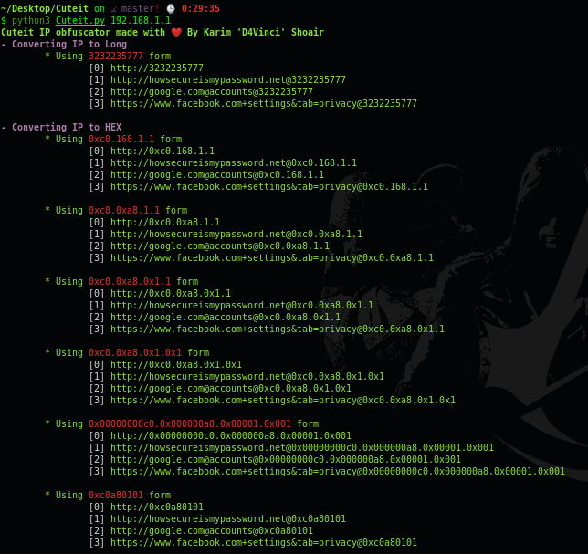
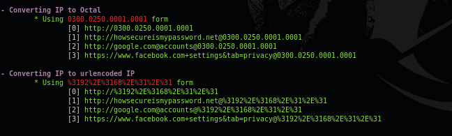
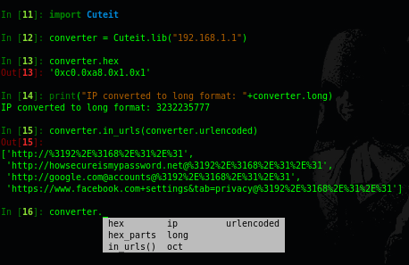

# Cuteit [](http://www.python.org/download/) [](http://www.python.org/download/) 
**IP obfuscator made to make a malicious ip a bit cuter :smile:**

A simple python tool to help you to social engineer, bypass whitelisting firewalls, potentially break regex rules for command line logging looking for IP addresses and obfuscate cleartext strings to C2 locations within the payload.

All of that is simply done with obfuscating ip to many forms.

## Usage
```
usage: Cuteit.py [-h] [--disable-coloring] ip

positional arguments:
  ip                  IP you want to convert

optional arguments:
  -h, --help          show this help message and exit
  --disable-coloring  Disable colored printing
```

## Screenshot



## Using it as a module!
You can use this script as a module in your python scripts as follows:
```
import Cuteit
convert = Cuteit.lib(ip)
print(convert.hex)
```
and the photo bellow shows that in action:



## Donation
Rewriting and improving this tool took me a lot of focus and time.
So if this tool has been useful for you, feel free to thank me by buying me a coffee :)

[](https://buymeacoffee.com/d4vinci)
