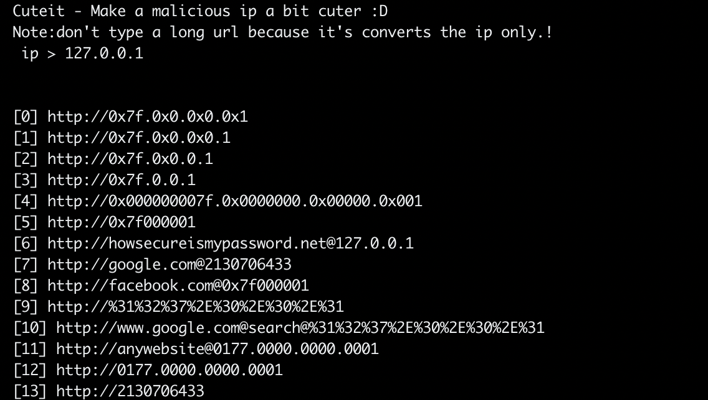

# Cuteit - Make a malicious ip a bit cuter :smile:

A simple python tool to help you to social engineer, bypass whitelisting firewalls, potentially break regex rules for command line logging looking for IP addresses and obfuscate cleartext strings to C2 locations within the payload.

All of that can be simply done by obfuscating IPs to many different forms.

## Running

    python Cuteit.py

## Screenshot

## Notes

-   Works with Python 2 & 3
